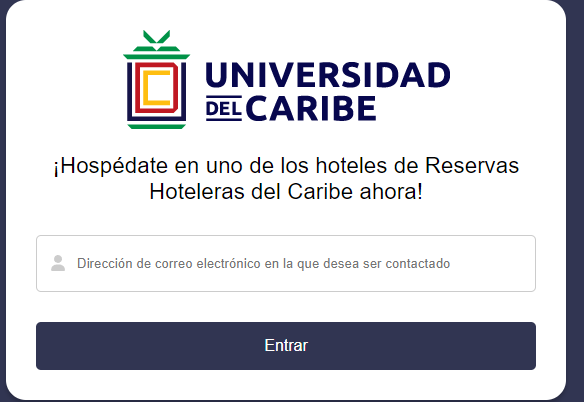

# Reservas Hoteleras del Caribe

Este es mi trabajo final para esta asignatura. Fue desarrollado con React.JS y Firebase. Para correr el proyecto en su PC, puede hacer un clón o un fork de este repositorio, instalar las dependencias del proyecto con <b><i>npm install</i></b> y crear una base de datos en Firebase, luego sustituir los credenciales que se encuentran en los componentes <b>Reservar.js</b> y <b>ReservasHome.js</b>. 

El comando que debe ser utilizado para hacer el live preview de la aplicación es <b><i>npm run</i></b>.

A continuación podrán ver algunas capturas de como funciona el sistema y también tendrán una explicación más detallada en mi presentación del trabajo:

